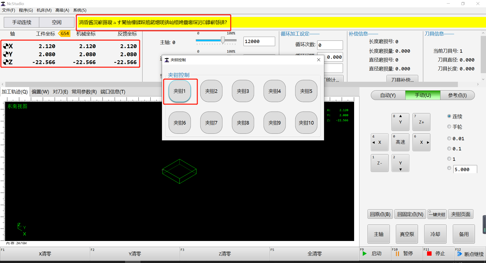
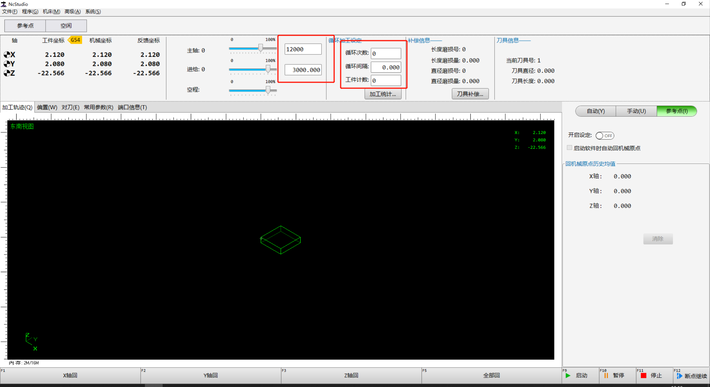

[toc]
## 木工行业铝切割软件

### 软件说明
1. 软件版本：15.543.1
2. 软件类型：Beta
### 软件问题
1. 当不满足夹钳夹紧条件时，点机夹钳，报警提示会显示乱码
应该显示的是报警提示里的内容，实际上为乱码，怀疑是编码方式相关问题

2. 路径
```
C:\Program Files\Weihong\NcStudio\UI\Pages\DialogBox
GrabBlowControlPage.xaml/lua
```
3. 报警判断
```
if spindleXPos < panelCutter.GrabXLimit and spindleZPos < panelCutter.GrabZLimit and spindleYPos < grabUpper and spindleYPos > grabLower then
	CLR.Log("Warning", LS("UI.SpindleInGrabLimit", "主轴位于该夹钳限制区域内，无法执行该操作！"))
else
	panelCutter[p].Grab = true
end
```
### 页面显示问题
1. 主界面进给速度/以及循环间隔显示留白


